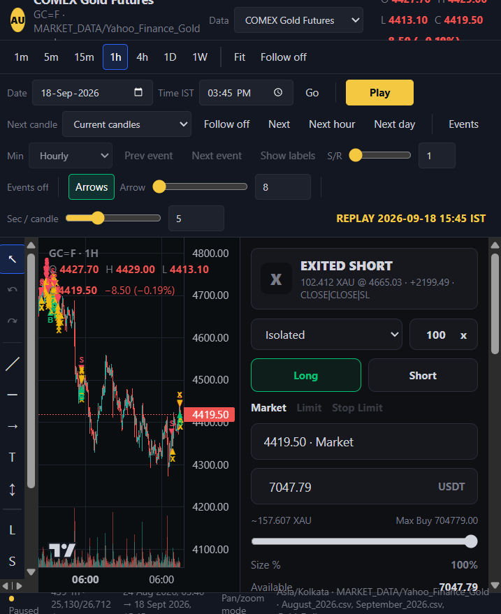
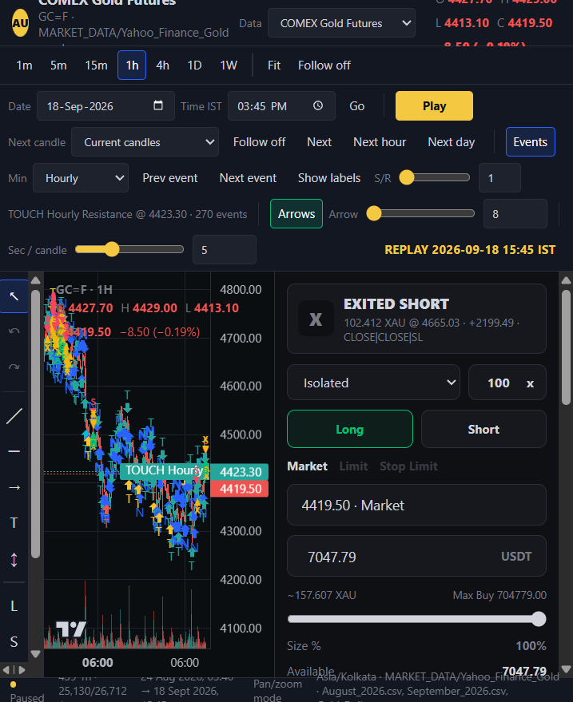

# Gold / silver replay chart

Local TradingView-style chart for **COMEX gold**, **Vantage gold spot**, and **Vantage silver spot**. Replay old candles, draw, and paper-trade. The chart **does not download** prices — it only reads folders under `MARKET_DATA/`.

Indian NSE swing backtests are separate: **[How to run Indian stock backtests](swing_strategy/README.md)**.



---

## Get the latest code

```bash
git clone https://github.com/ParmpalSinghGill/BackTestingStrategy.git
cd BackTestingStrategy
```

Already cloned:

```bash
git checkout main
git pull origin main
```

Needs Python 3 and pandas:

```bash
pip install -r requirements.txt
```

Run every command below from this repo folder.

---

## 1. Refresh gold / silver candles

Skip this if `MARKET_DATA/` already has files.

```bash
python src/data_fetchers/fetch_gold_1min.py
python src/data_fetchers/fetch_vantage_gold.py
python src/data_fetchers/fetch_vantage_silver.py
```

Windows: double-click `run_fetch_gold_1m.bat` (same three scripts).

| Data dropdown | Local folder | Symbol |
|---|---|---|
| COMEX Gold Futures | `MARKET_DATA/Yahoo_Finance_Gold` | `GC=F` |
| Vantage Gold Spot | `MARKET_DATA/TradingView_Vantage_Gold` | `XAUUSD` |
| Vantage Silver Spot | `MARKET_DATA/TradingView_Vantage_Silver` | `XAGUSD` |

---

## 2. Start the GUI

```bash
python gold_chart/app.py
```

Then open **http://127.0.0.1:8766/index.htm**

Windows: double-click `run_gold_chart.bat`.

If it prints that the chart is already running, just open the URL. If the page looks old, press Ctrl+F5 (or add `?v=62`).

That is the gold “backtest”: pick a Date + Time IST, press **Play** / **Next**, and paper-trade as if those candles were live.

---

## 3. What to click

- **Data** — gold futures, gold spot, or silver spot.
- **1m … 1W** — timeframe. **Fit** fills the window.
- **Date / Time IST → Go** — jump the replay cursor. **Play** walks forward.
- **Long / Short** — Isolated paper book. Drag **TP** and **SL** on the chart (they fill only on a later touch). **25 / 50 / 75%** closes part of the size.
- **Events** — optional S/R labels. **Min** (Hourly default) is the finest label TF; coarser stays on.



Paper CSVs (not in git): `gold_chart/paper/paper_trades.csv`, `paper_transactions.csv`, `paper_daily_pnl.csv`.

---

## Other code in this repo

| What | Where |
|---|---|
| Indian NSE swing backtest, 4 PM names, live books | [swing_strategy/README.md](swing_strategy/README.md) |
| Indian 15m intraday backtest | [intraday_strategy/README.md](intraday_strategy/README.md) |
