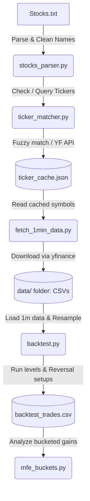

# System Analysis: Stock Backtesting Platform

This system is an automated, historical backtesting framework designed for **high-low reversal strategies** on daily watchlists. It matches stock names from a watchlist to Yahoo Finance tickers, downloads 1-minute historical intraday bar data, and runs a multi-timeframe reversal test across historical key price levels.

---

## 1. Architectural Overview & Workflow

The system operates in a multi-stage pipeline:



---

## 2. Core Reversal Strategy Logic

The strategy focuses on **mean reversion** at key intraday support and resistance levels.

### A. Reference Levels
For each trade date (based on when the stock was on the watchlist), the system extracts levels from history prior to that date:
1. **Previous Day High/Low**: The highest high and lowest low of the last available trading day.
2. **Pivot Support/Resistance**: Key pivot points identified using a rolling window logic similar to the EventFinder script (checks for consecutive bars making higher/lower highs/lows and big volume expansions, then filters out invalidated levels).

### B. Signal & Entry Setups
A trade setup is armed when the asset's close crosses a level (either `up` or `down`).

#### 1. Short Reversal (Cross Up)
* **Setup**: The price crosses **above** a reference level.
* **Signal Candle**: The **first RED candle** (close < open) that closes *after* the crossing.
* **Arming**: A short trade is armed at the **LOW** of the signal candle. The initial stop-loss (SL) is set at the signal candle's **HIGH** plus a buffer (`SL_BUFFER_PCT` = 0.01%).
* **Trigger**: The trade enters short if a subsequent candle's low breaks below the signal candle's low.
* **Invalidation**: The setup is discarded if a subsequent candle trades above the signal candle's high before the entry is triggered.

#### 2. Long Reversal (Cross Down)
* **Setup**: The price crosses **below** a reference level.
* **Signal Candle**: The **first GREEN candle** (close > open) that closes *after* the crossing.
* **Arming**: A long trade is armed at the **HIGH** of the signal candle. The initial stop-loss (SL) is set at the signal candle's **LOW** minus a buffer (`SL_BUFFER_PCT` = 0.01%).
* **Trigger**: The trade enters long if a subsequent candle's high breaks above the signal candle's high.
* **Invalidation**: The setup is discarded if a subsequent candle trades below the signal candle's low before the entry is triggered.

### C. Trade Management & Exits
Once a trade is active:
* **Position Size**: Runs with a static `qty = 1` for metrics collection.
* **Trailing Stop-Loss**: Adapts using a pivot-based trailing stop with a 3-pivot threshold:
  * **Long trades**: Watches for formed **Higher Lows (HL)**. Once $\ge 3$ higher lows are formed, the stop-loss trails to `higher_lows[-3]` (ensuring there are always at least 2 subsequent higher lows). The stop-loss is only updated if the new level is higher than the current trailing stop.
  * **Short trades**: Watches for formed **Lower Highs (LH)**. Once $\ge 3$ lower highs are formed, the stop-loss trails to `lower_highs[-3]` (ensuring there are always at least 2 subsequent lower highs). The stop-loss is only updated if the new level is lower than the current trailing stop.
* **Exit Reasons**:
  * **Stop-Loss Hit (`sl_hit`)**: Price reaches the trailing stop level.
  * **End of Day (`eod`)**: If still active by `EXIT_TIME` (default: 15:10), the trade exits at the market price.

---

## 3. Codebase Walkthrough

### [Stocks.txt](file:///C:/Users/parmp/OneDrive/CODE/Stocks/BackTest/Stocks.txt)
* **Purpose**: Input file holding the daily watchlists.
* **Format**: Lines matching:
  `Stocks to Watch Today: [CompanyA], [CompanyB] in focus on [DD Month]`

### [ticker_matcher.py](file:///C:/Users/parmp/OneDrive/CODE/Stocks/BackTest/ticker_matcher.py)
* **Purpose**: Handles mapping noisy/abbreviated Indian company names to Yahoo Finance tickers.
* **Logic**:
  1. Downloads/uses the official NSE symbol list ([EQUITY_L.csv](file:///C:/Users/parmp/OneDrive/CODE/Stocks/BackTest/EQUITY_L.csv)).
  2. Tries an exact ticker-code match (e.g. "HG Infra" -> `HGINFRA.NS`).
  3. Queries the Yahoo Finance Search API, prioritizing NSE (`.NS`) and BSE (`.BO`) listings.
  4. Fuzzy-matches company names using the `rapidfuzz` library's `token_sort_ratio` against the NSE master list if offline or API is down.

### [stocks_parser.py](file:///C:/Users/parmp/OneDrive/CODE/Stocks/BackTest/stocks_parser.py)
* **Purpose**: Parses [Stocks.txt](file:///C:/Users/parmp/OneDrive/CODE/Stocks/BackTest/Stocks.txt) and aggregates watchlists.
* **Output**: Produces and maintains [ticker_cache.json](file:///C:/Users/parmp/OneDrive/CODE/Stocks/BackTest/ticker_cache.json) to store resolved company names and avoid repeated web queries.

### [fetch_1min_data.py](file:///C:/Users/parmp/OneDrive/CODE/Stocks/BackTest/fetch_1min_data.py)
* **Purpose**: Downloads historical 1-minute market data from Yahoo Finance.
* **Features**:
  * Yahoo Finance restricts 1m data to the last ~30 days and limits requests to max 7 days per call.
  * This script automatically chunks the requested range (default 30 days) into <= 7-day slices, queries `yfinance`, stitches the datasets together, and saves them to the `data/` directory.
  * Fetches commodities (`CL=F` for Crude Oil, `NG=F` for Natural Gas) and all watchlisted stocks.

### [backtest.py](file:///C:/Users/parmp/OneDrive/CODE/Stocks/BackTest/backtest.py)
* **Purpose**: The main engine executing the backtest.
* **Flow**:
  1. Loads stock 1m historical CSV files.
  2. Resamples data to multiple timeframes: `1m`, `5m`, `10m`, and `15m`.
  3. Computes reference levels (`prev_day_high`, `prev_day_low`, and pivot supports/resistances).
  4. Scans for level crossings and fires setups up to `MAX_PASSES` (3) per level.
  5. Implements the entry, exit, pivot-based trailing stop, and approximate intraday FYERS cost/fee calculation.
  6. Saves detailed trades in [backtest_trades.csv](file:///C:/Users/parmp/OneDrive/CODE/Stocks/BackTest/backtest_trades.csv).
  7. Prints comprehensive execution metrics: win/loss rates, average risk/reward (R), average Maximum Favorable Excursion (MFE), and expectancy.

### [mfe_buckets.py](file:///C:/Users/parmp/OneDrive/CODE/Stocks/BackTest/mfe_buckets.py)
* **Purpose**: Simple utility script to inspect [backtest_trades.csv](file:///C:/Users/parmp/OneDrive/CODE/Stocks/BackTest/backtest_trades.csv) and print bucketed statistics.
* **Metrics**: Calculates what percentage of trades achieved positive price movement of $\ge 1\%$, $\ge 2\%$, and $\ge 3\%$ in their favor (MFE) before exiting or stopping out.

---

## 4. How to Run the Workflow

To execute a complete backtest run, follow these steps:

1. **Download 1m historical data**:
   ```bash
   python fetch_1min_data.py
   ```
   *(This parses [Stocks.txt](file:///C:/Users/parmp/OneDrive/CODE/Stocks/BackTest/Stocks.txt), matches tickers, downloads the past 30 days of 1-minute data in chunks, and stores files under `data/`)*

2. **Execute the backtest**:
   ```bash
   python backtest.py
   ```
   *(This runs the multi-timeframe reversal strategy, logs trades to [backtest_trades.csv](file:///C:/Users/parmp/OneDrive/CODE/Stocks/BackTest/backtest_trades.csv), and prints detailed metrics)*

3. **Check MFE distribution**:
   ```bash
   python mfe_buckets.py
   ```
   *(This reads the resulting trades and prints performance buckets by percentage gain)*

4. **Automated Weekly Fetching (Scheduled Task)**:
   An incremental data update scheduled task has been configured using Windows Task Scheduler (`schtasks`).
   * **Task Name**: `StockBacktest_Fetch1m`
   * **Schedule**: Weekly on **Saturdays at 6:00 PM**.
   * **Execution**: Runs the [run_fetch.bat](file:///C:/Users/parmp/OneDrive/CODE/Stocks/BackTest/run_fetch.bat) wrapper script to perform an incremental download for all watchlist stocks + commodities, merging new data into the existing CSVs to preserve long-term history.
