# SwingNoMl Strategy Step-by-Step Execution Flowchart

This document details the complete end-to-end execution pipeline for the **SwingNoMl (Pure Price-Action 1:3 RR)** strategy engine.

---

## 1. Master Strategy Flowchart (Mermaid)

```mermaid
flowchart TD
    START["Start Daily Engine Execution (2010 to 2026)"] --> PHASE1["Phase 1: Setup Identification (Candle C1)"]

    subgraph PHASE1_SUB ["Phase 1: Setup Identification (Candle C1)"]
        PHASE1 --> SCAN["Scan Daily OHLC Data across 2,081 Equities"]
        SCAN --> C1_CHECK1{"Is C1 Close > C1 Open?<br/>(Green Candle)"}
        C1_CHECK1 -- No --> DISCARD1["Discard Setup"]
        C1_CHECK1 -- Yes --> C1_CHECK2{"Is C1 Close < Support AND<br/>C1 High < Support?"}
        C1_CHECK2 -- No --> DISCARD1
        C1_CHECK2 -- Yes --> TF_DEDUP["Apply Timeframe Priority:<br/>Yearly > Monthly > Weekly"]
    end

    TF_DEDUP --> PHASE2["Phase 2: Calculate Planned Trade Parameters"]

    subgraph PHASE2_SUB ["Phase 2: Planned Price Calculation"]
        PHASE2 --> P_ENTRY["Planned Entry Price = C1 High × 1.001"]
        P_ENTRY --> P_SL["Stop-Loss Price (SL) = Support × 0.999"]
        P_SL --> P_RISK["Planned Risk/Share = Planned Entry - SL"]
        P_RISK --> P_TP["Target Price (1:3 RR) = Planned Entry + (3.0 × Planned Risk)"]
    end

    P_TP --> PHASE3["Phase 3: Multi-Bar Entry Evaluation Engine (C2 → C3 Window)"]

    subgraph PHASE3_SUB ["Phase 3: Entry Evaluation (C2 → C3 Window)"]
        PHASE3 --> BAR_LOOP["Set Bar k = C2 (c1_idx + 1)"]
        BAR_LOOP --> INVALID_CHECK{"Is Bar Low_k < C1 Low?"}
        INVALID_CHECK -- "Yes (Breakdown)" --> INVALIDATE["INVALIDATE SETUP<br/>(Cancel Pending Order)"]
        
        INVALID_CHECK -- "No (Valid)" --> TRIG_CHECK{"Is Bar High_k > C1 High?"}
        TRIG_CHECK -- No --> WAIT_NEXT{"Is k < C1 + Max Wait?"}
        WAIT_NEXT -- Yes --> NEXT_BAR["Advance to Next Bar k = k + 1 (e.g. C3)"] --> BAR_LOOP
        WAIT_NEXT -- No --> EXPIRE["SETUP EXPIRED<br/>(No Entry Triggered)"]

        TRIG_CHECK -- Yes --> GAP_CHECK{"Is Bar Open_k > Planned Entry?<br/>(Gap-Up Opening)"}
        
        GAP_CHECK -- "Yes (Gap-Up)" --> TOUCH_CHECK{"Does Bar Low_k ≤ Planned Entry?<br/>(Case #5 TouchPlannedEntry Rule)"}
        TOUCH_CHECK -- No --> SKIP_BAR["Skip Bar (Price never touched Entry)"] --> WAIT_NEXT
        TOUCH_CHECK -- Yes --> FILL_CASE5["Fill at Actual Entry = Planned Entry Price"]
        
        GAP_CHECK -- "No (Normal / Gap-Down)" --> FILL_NORMAL["Fill at Actual Entry = max(Planned Entry, Bar Open_k)"]
    end

    FILL_CASE5 --> PHASE4["Phase 4: Intraday Portfolio Execution & Risk Sizing"]
    FILL_NORMAL --> PHASE4

    subgraph PHASE4_SUB ["Phase 4: Intraday Execution & Position Sizing"]
        PHASE4 --> DAY_START["Day D Execution Loop"]
        DAY_START --> ORDER_PRIORITY["Order Precedence Rule:<br/>1. ENTRIES FIRST on Day D<br/>2. EXITS SECOND on Day D"]
        ORDER_PRIORITY --> AVAIL_CASH["Check Cash Balance Available at Start of Day D"]
        AVAIL_CASH --> SIZING["Quantity = floor( min( Risk Cap / Risk per Share, Available Cash / Fill Price ) )"]
        SIZING --> CASH_CHECK{"Quantity > 0 AND<br/>Cash Balance Available?"}
        CASH_CHECK -- No --> DISCARD2["Skip Entry (Insufficient Capital / Risk Cap)"]
        CASH_CHECK -- Yes --> DEDUCT_CASH["Deduct Purchase Spend from Cash Balance<br/>Add Trade to Open Positions Ledger"]
    end

    DEDUCT_CASH --> PHASE5["Phase 5: Daily Position Lifecycle & Exit Processing"]

    subgraph PHASE5_SUB ["Phase 5: Position Lifecycle & Tax Calculation"]
        PHASE5 --> MONITOR["Monitor Open Positions Daily (Day D onwards)"]
        MONITOR --> SL_CHECK{"Is Day Low ≤ Stop-Loss Price?"}
        SL_CHECK -- Yes --> EXIT_SL["Exit at Stop-Loss Price<br/>Outcome: LOSS"]
        
        SL_CHECK -- No --> TP_CHECK{"Is Day High ≥ Target Price?"}
        TP_CHECK -- Yes --> EXIT_TP["Exit at Target Price (1:3 RR)<br/>Outcome: PROFIT"]
        
        TP_CHECK -- No --> HOLD["Hold Position for Next Day"]
        
        EXIT_SL --> TAX_CALC["Calculate Statutory Taxes:<br/>STT (0.1%), Exchange Fee (0.00345%),<br/>Stamp Duty (0.015%), SEBI (0.0001%), GST (18%)"]
        EXIT_TP --> TAX_CALC
        TAX_CALC --> CREDIT_CASH["Credit Principal + Net PnL to Cash Balance<br/>(Available for New Entries on Day D+1)"]
    end

    CREDIT_CASH --> PHASE6["Phase 6: Institutional Output Statement & Chart Generation"]

    subgraph PHASE6_SUB ["Phase 6: Output Generation"]
        PHASE6 --> LEDGER_ROW["Append Row to 21-Column Institutional Account Statement"]
        LEDGER_ROW --> PLOT_PNG["Render 200 DPI Candlestick Trade Chart PNG:<br/>• Dark Green (#006400) Solid Entry Line<br/>• Dark Red (#8B0000) Solid Exit Line<br/>• Wick-Preserving Arrow Markers"]
        PLOT_PNG --> EXCEL_EXPORT["Export Final Ledger to Excel (.xlsx) & CSV (.csv)"]
    end
```

---

## 2. Step-by-Step Architectural Walkthrough

### Phase 1: Setup Identification (Candle C1)
1. **Daily Scan**: Scans daily OHLC data across 2,081 Indian stock tickers.
2. **Candle C1 Rules**:
   - $C1\text{ Close} > C1\text{ Open}$ (Green candle showing buying pressure).
   - $C1\text{ Close} < \text{Support}$ AND $C1\text{ High} < \text{Support}$ (Price swept below support liquidity).
3. **Timeframe Priority Hierarchy**: If multiple timeframes trigger on the same date:
   $$\text{Yearly Liquidity} > \text{Monthly Liquidity} > \text{Weekly Liquidity}$$

---

### Phase 2: Planned Price Calculation
- **Planned Entry Price** $= C1\text{ High} \times 1.001$ (+0.1% buffer).
- **Stop-Loss Price (SL)** $= \text{Support Price} \times 0.999$ (-0.1% buffer).
- **Planned Risk per Share** $= \text{Planned Entry} - \text{SL}$.
- **Target Price (1:3 RR)** $= \text{Planned Entry} + (3.0 \times \text{Planned Risk})$.

---

### Phase 3: Multi-Bar Entry Evaluation Engine (C2 → C3 Window)
1. **Sequence Loop**: Starting at candle **C2** ($k = C1 + 1$):
2. **Invalidation Check**: If $\text{Low}_k < C1\text{ Low}$, the setup is **cancelled immediately** (invalidated).
3. **Entry Trigger Check**: If $\text{High}_k > C1\text{ High}$:
   - **Gap-Up Opening ($\text{Open}_k > \text{Planned Entry}$)**:
     - Apply Case #5 (`TouchPlannedEntry`): If $\text{Low}_k \le \text{Planned Entry}$, fill at $\text{Actual Entry} = \text{Planned Entry}$.
     - If $\text{Low}_k > \text{Planned Entry}$, skip bar and advance to next bar (C3).
   - **Normal / Gap-Down Opening ($\text{Open}_k \le \text{Planned Entry}$)**:
     - Fill at $\text{Actual Entry} = \max(\text{Planned Entry}, \text{Open}_k)$.
4. **Window Rule**: If C2 does not reach entry price but stays above C1 Low, the setup remains active for C3 up to max wait window.

---

### Phase 4: Intraday Execution & Position Sizing
1. **Intraday Priority**:
   $$\text{ENTRIES FIRST on Day } D \longrightarrow \text{EXITS SECOND on Day } D$$
   *Cash freed from exits on Day $D$ becomes available for new entries on Day $D+1$.*
2. **Position Sizing Formula**:
   $$\text{Quantity} = \left\lfloor \min\left( \frac{\text{Fixed Risk Cap per Trade}}{\text{Risk per Share}}, \frac{\text{Available Cash Balance}}{\text{Actual Entry Price}} \right) \right\rfloor$$
3. Trade capital is immediately deducted from liquid cash upon entry.

---

### Phase 5: Position Lifecycle & Tax Calculation
1. **Intraday Monitoring**:
   - **Stop-Loss Hit**: If $\text{Daily Low} \le \text{SL Price} \to$ Exit at SL price (`LOSS`).
   - **Target Hit**: If $\text{Daily High} \ge \text{Target Price} \to$ Exit at Target price (`PROFIT`).
2. **Statutory Tax Calculations**:
   - Deducts STT (0.1%), Exchange Fees (0.00345%), Stamp Duty (0.015%), SEBI Turnover Fee (0.0001%), and GST (18%).
3. Proceeds credited to portfolio cash for subsequent trading days.

---

### Phase 6: Institutional Output Generation
1. **21-Column Account Statement**:
   - Appends transaction record to Excel & CSV with `=HYPERLINK(...)` formulas pointing to trade PNGs.
2. **Candlestick PNG Plot Charts**:
   - Multi-thread renders 200 DPI candlestick charts featuring **Dark Green (`#006400`) Entry Line**, **Dark Red (`#8B0000`) Exit Line**, Support Line (`#2563EB`), Stop-Loss (`#DC2626`), Target (`#059669`), and wick-preserving marker arrows.
